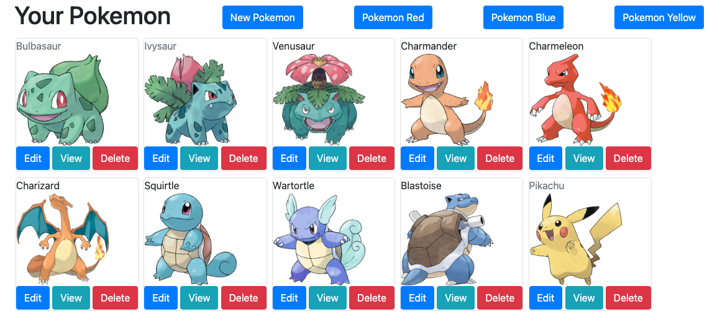

# PokemonDB

This a database for tracking the pokemon you catch in Pokemon Red, Blud, and Yellow 

You can track if whether you have seen the pokemonm in general, and which game you have caught it in

**Live Link:**
[View the Database](https://pokemondb117.herokuapp.com/pokemon)

# Code/Technologies Used
* HTML5 (.html) 
* bootstrap 
* .css
* .js (javaScript)
* .hbs (handbleBars)
* heroku cli

# Hurdles
* Routing/filtering the pages based on the game and only showing the pokemon that have been caught in that specific game
* setting up the seed file to be able to be seeded without revealing backend usernames/passwords

# Future Inclusions
* more game options i.e. Gold/Silver/Crystal, Ruby/Saphire/Emerald, etc..
* when deleting a Pokemon AND inside a game route, it only removes the pokemon from THAT game
* tracking seen status across individual games
* drop-down/hamburger menus to remove clutter from top page
